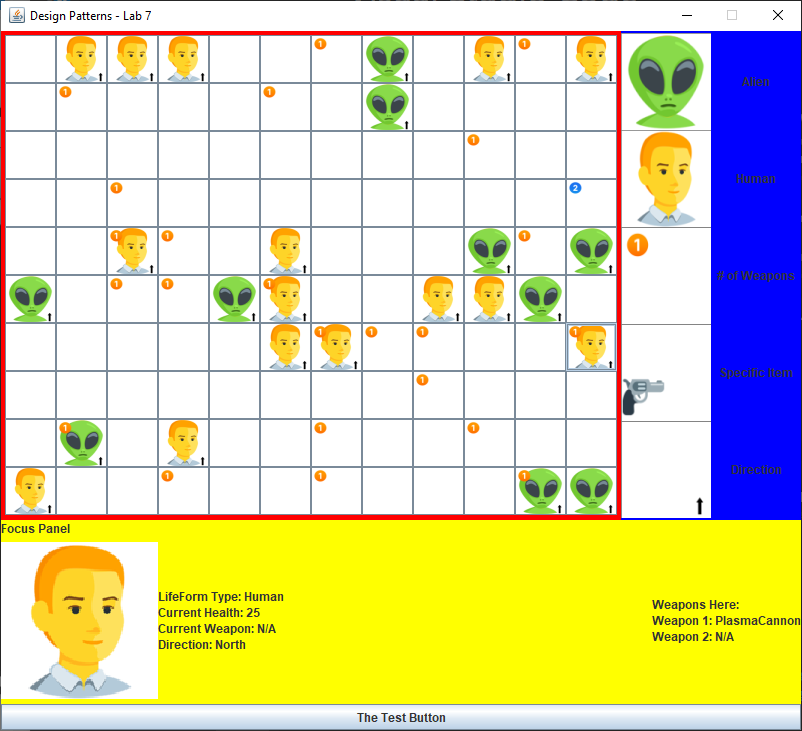
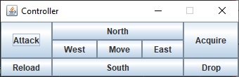

# MIPS Assembler

## Program Description: 

> One further stage was planned for this project, but time constraints prevented it from being assigned. (This is why some things appear unfinished.)

This Java game has a randomly generated board where you play as either the humans or the aliens.
Both types of lifeforms can be controlled, but the intent is to have two players locally where one plays as the humans and the other plays as the aliens.

Some aliens may generate health quickly, while others vary over time or are incapable of health recovery.
Weapons spawn randomly across the board as well, and can be picked up by lifeforms by navigating to that cell and using the Acquire action.

With the exception of lab0, one running project made up all of the labs in this class.
This program makes use of various design patterns in its composition.
Each stage of the lab consisted of adding new functionality to the game corresponding to a different design pattern strategy.

 

## Co-Authors

- Scott Bucher
- Brennan Mulligan
- Josh Lewis
- Evan Paules

 

## How to Run:

This project was not turned into an executable, and was typically run through a Java IDE such as Eclipse or IntelliJ.

For reference main method is located in ``gameplay/Simulator.java``

Upon running the game, two GUI windows will appear. The larger one is the board, while the smaller one is the Controller. Click on a cell with a human, and you can use the controller to choose an action for that human.

### Understanding the Main GUI

The game is controlled through two detailed GUIs that are created when the program runs. The larger and more colorful GUI is the board or environment. 

> If these colors are hard on the eyes, the button at the bottom can change the color scheme.

The rightmost section acts as a key or legend, explaining what each symbol in a given cell means. All art is drawn dynamically to each cell image, and the full range of sprites can be seen by looking at the `img/` folder.

The bottom section is an expanded view of whichever cell was last clicked on. 
This provides information about any weapons and lifeforms present in a given cell.
If there is a lifeform in the cell, its current health, weapon, and direction will be specified.

### The Controls

The game is controlled through the smaller GUI, labelled "Controller."
The button you click affects the attributes of the lifeform in the cell.
To use this, you must first click on a cell with a lifeform in it.
Specific functionalities are listed below:

| Control | Explanation |
| -- | -- |
| Attack | If the lifeform has a weapon, they will fire it. Otherwise, they will melee. |
| Reload | Reloads the held weapon, if possible. |
| North, South, East, West | These buttons turn the lifeform in the corresponding cardinal direction, represented by the arrow on the cell. |
| Move | Moves the lifeform in the direction they are facing. |
| Acquire | If there is an unassigned weapon in the cell, the lifeform picks it up |
| Drop | Removes the lifeform's held weapon and leaves it behind in the cell |

 

## Known Bugs:

You must click on the cell a lifeform moves to if you want to control that lifeform again.